# HoMM OE Template Editor

An editor for **Heroes of Might and Magic: Olden Era** random-map templates (`.rmg.json` files).

Templates define the zones the random map generator places, how they connect, what creatures and treasures appear in them, and which players spawn where. The format is JSON, but hand-editing dozens of cross-referenced zones is tedious and error-prone. This tool gives you a graph canvas, a per-field inspector, a catalog browser with game thumbnails, validation, multi-template tabs and undo/redo on top of the same JSON files the game reads.

When you save a template, the editor also writes a sibling `.png` next to it - a stylized map of the zones and connections with the canvas positions embedded in the EXIF data - so you can preview the layout without opening it again, and re-open it with the same layout you saved.

---

## Example UI

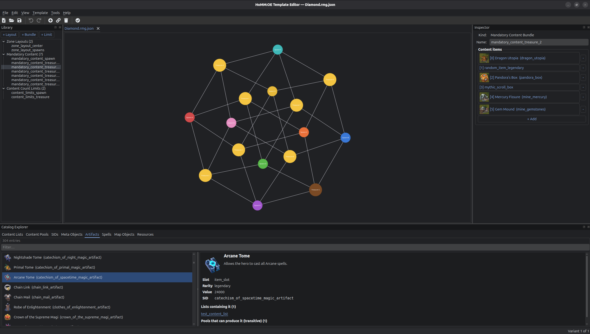

## Install

Requires **Python 3.12+** and a working OpenGL stack (any modern desktop Linux/Mac/Windows works out of the box).

```bash
# clone
git clone https://github.com/ignis-sec/HoMM-OE-Template-Editor.git
cd HoMM-OE-Template-Editor

# create a project-local virtualenv
python3.12 -m venv .venv
source .venv/bin/activate          # Windows: .venv\Scripts\activate

# install the editor
pip install -e .
```

For development tooling (ruff, pytest, mypy):

```bash
pip install -e ".[dev]"
```

That's everything. No system packages, no extra config.

### Install (For plebs)

If you are [this guy](https://www.reddit.com/r/programminghumor/comments/1nq97wc/he_has_a_lot_to_say/), download the latest `HoMM OE Template Editor-vX.Y.Z-windows.exe` from the releases page. It's a single-file build, no installer.

---

## Run

* Running from source, or on Unix:
```bash
templategen            # console script installed by pip
# or
python -m templategen
```

* Windows:

You have an .exe file. You got this champ.


The first time you launch, the editor looks for the Steam install of Heroes of Might and Magic: Olden Era at its default location. If it finds one, it offers to mine the game's `Core.zip` for artifact, spell, interactable, resource, and faction thumbnails and a catalog snapshot so dropdowns and the catalog explorer can show rich icons instead of bare SIDs. You can always re-run this from **Tools -> Rebuild Catalog from game install...**, or point it at a custom location if your install lives somewhere else.

After that, the window opens empty. Use **File -> Open** to load any `.rmg.json` - the project's own examples or templates you've copied out of the game's `Core/Templates/` directory. Use **File -> New** for a blank template. Multiple templates can be open at once in tabs.

## Okay but, where do I save the templates?

Linux:

```
~/.steam/steam/steamapps/common/Heroes of Might and Magic Olden Era/HeroesOldenEra_Data/StreamingAssets/map_templates/user
```

Windows:
```
C:\\Program Files (x86)\\Steam\\steamapps\\common\\Heroes of Might & Magic Olden Era\\HeroesOldenEra_Data\\StreamingAssets\\map_templates\\user
```

### Catalog data (optional but recommended in case game was updated)

The catalog explorer, the autocomplete dropdowns, and the in-line icon thumbnails are populated from a snapshot of the game's data files plus the textures extracted from `Core.zip`. A small pre-built snapshot ships in `data/catalog.json`, but icons are only available if you've pointed the editor at a real game install. To regenerate the snapshot from a fresh game install:

```bash
python scripts/build_catalog.py /path/to/HeroesOldenEra_Data
```

Or from inside the editor: **Tools -> Rebuild Catalog from game install...** Extracted assets are written to your platform's `AppLocalDataLocation` and the game directory you picked is remembered, so subsequent rebuilds skip the picker.

---

## What the editor does

### Canvas
- Each zone is a draggable circle. Its size scales with the zone's `size` attribute (smallest zone in the variant pins to a base radius; others scale up with `sqrt(size)`).
- Color follows the zone's role:
  - **Spawn zones** get the player color (red, blue, orange, green, purple, teal, yellow, pink for Player 1–8).
  - **Treasure zones** (any zone without a spawn) shade from brown for the lowest total content value to gold for the highest, interpolated across the current variant.
- Connections are lines styled by type (solid, dashed for portals, dotted for proximity, thick red for gladiator arena).
- Initial layout is computed with Kamada-Kawai (proximity edges excluded so they don't pull the graph into knots); you can drag any zone to taste, and your positions are saved in the PNG's EXIF data on next save.

### Editing
- **Add Zone** - toggle the toolbar button, then click on the canvas to place a new zone. New zones default to size 5 and use the first available zone layout.
- **Connect Zones** - toggle the toolbar button, click the source zone, then the target. Creates a Direct connection.
- **Delete** - select zones or connections on the canvas and press `Delete`. Removing a zone also removes any connections that referenced it, in a single undo step.
- All edits go through a `QUndoStack` - `Ctrl+Z` / `Ctrl+Shift+Z` undo and redo, per open template.

### Road graph view (`Ctrl+R`)
Toggle the road icon (next to Validate) to swap the zone graph for a road graph. Each MainObject in each zone becomes a node (faction icon for cities, player-coloured circle for spawns, type glyph for the rest), each non-proximity connection becomes a small diamond at the midpoint between the two zones it links, and every Road in `zone.roads` is drawn between the resolved endpoints in road-type colour (stone = light grey, dirt = warm brown).

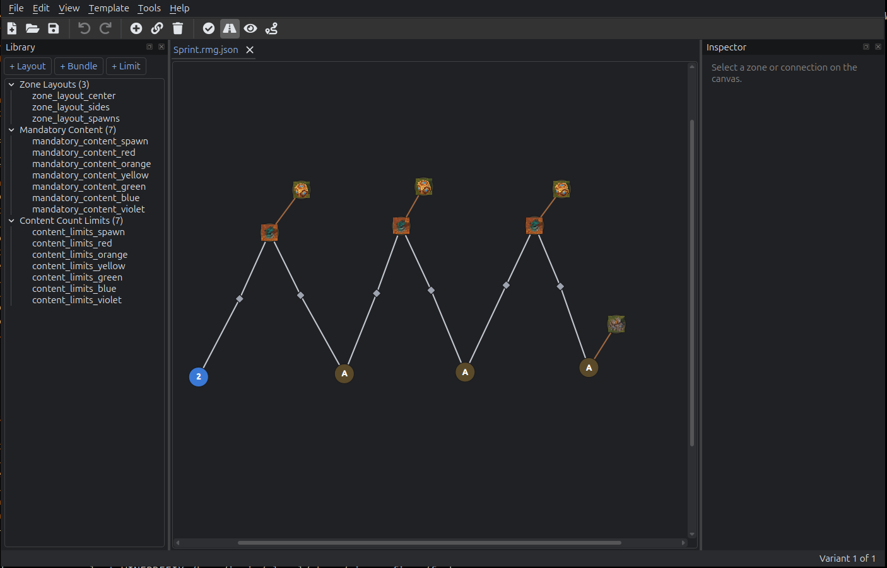

Two extra toolbar toggles light up while road view is on:
- **Show All Bundle Objects** (`Ctrl+Shift+R`) - also draws every named `ContentItem` from the bundles the zone's `mandatoryContent` references (mana wells, mines, named pandora boxes, etc.), with their catalog thumbnails. Without it only items actually referenced by some road anchor are shown.
- **Add Road** (`Ctrl+Alt+R`) - click any two nodes (object, connection, or bundle item) and a road is synthesised in the right zone. If the endpoints are in different zones, the editor picks the linking non-proximity connection, adds two roads (one per zone) routed through it, and flips the connection's `has road` checkbox - all under one undo step. Unnamed bundle items get a synthesized `name_<sid>` so the road anchor can resolve them. `Delete` removes selected roads.

### Inspector (right dock)
Click any zone, connection, layout, bundle, count-limit, content item, or main object to see all its fields. Lists and embedded objects support drill-in navigation with a back button. Reference fields (SID, content list, content pool, biome, faction, etc.) use editable autocomplete dropdowns backed by the catalog - dropdowns are narrowed per-field to the right SID kind (artifact, spell, resource, interactable, ...), and rich items show their in-game thumbnail next to the name.

| | |
|---|---|
| 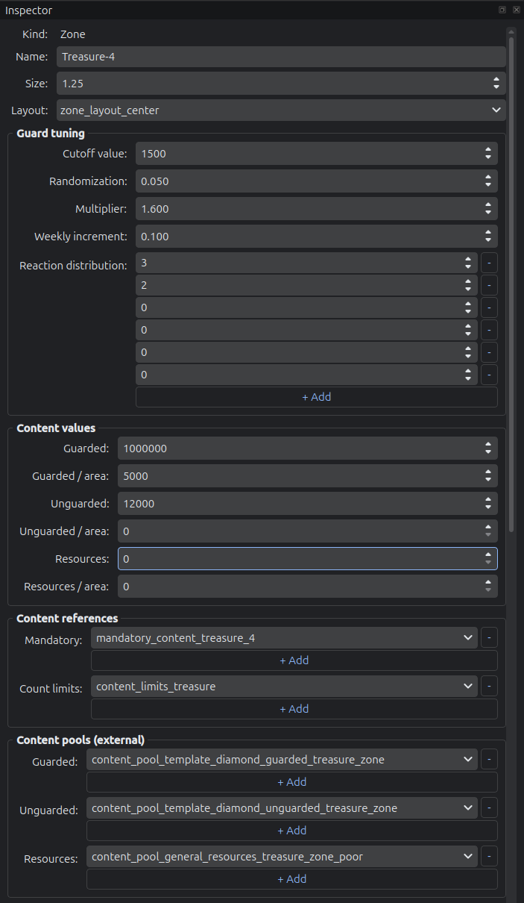 | 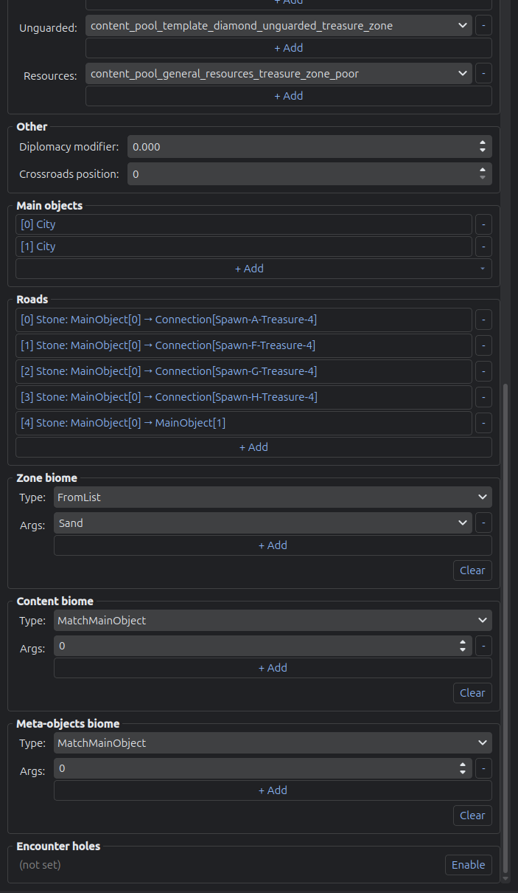 |

Drill into the zone's main objects, roads, connections, content items, or count-limit entries to edit them in-place:

| City main object | Road | Connection |
|---|---|---|
| 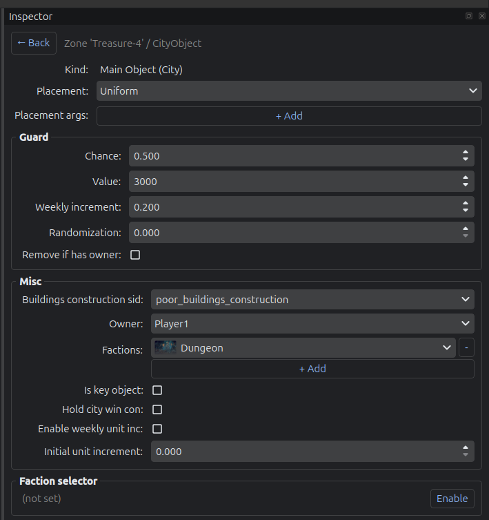 | 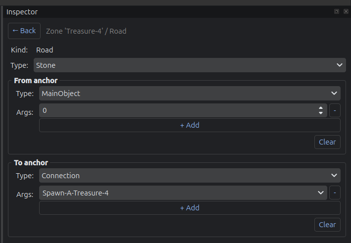 | 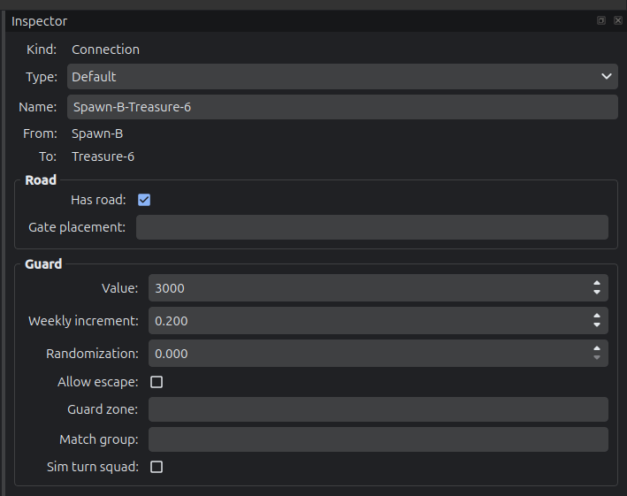 |

| Content item | Limit item |
|---|---|
| 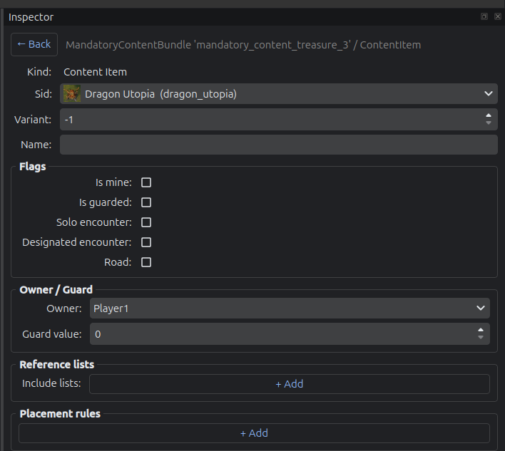 | 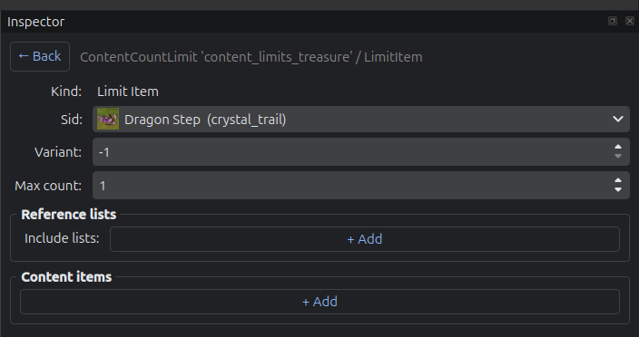 |

### Library (left dock)
Manage the template-level objects that zones reference by name:
- **Zone Layouts** - terrain/obstacle/elevation presets
- **Mandatory Content** - bundles of must-place objects
- **Content Count Limits** - caps on how often certain content can appear

Right-click for copy/cut/paste/duplicate. Paste works across tabs, so you can copy a layout from one open template into another.

### Catalog Explorer (bottom dock, **Tools -> Show Catalog Explorer**)
Eight tabs: Content Lists, Content Pools, SIDs, Meta Objects, Artifacts, Spells, Map Objects, Resources. Each shows what's defined in the game's data with thumbnails, plus reverse lookups (which pools contain a given SID, which lists a pool draws from, etc.). Cross-references are clickable links inside the detail pane.

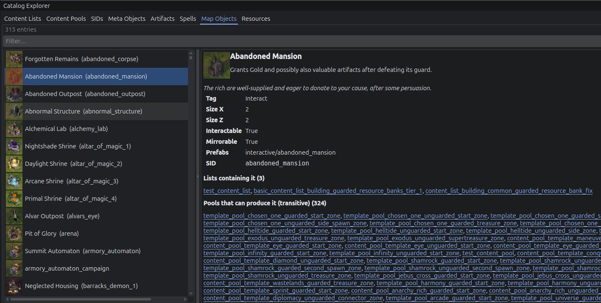

### Template settings
**Template -> Settings...** opens a six-tab dialog for the template-level fields: basics, game rules, win conditions, global bans, bonuses, and value overrides. Changes apply atomically when you click OK.

| Basic | Game rules | Win conditions |
|---|---|---|
| 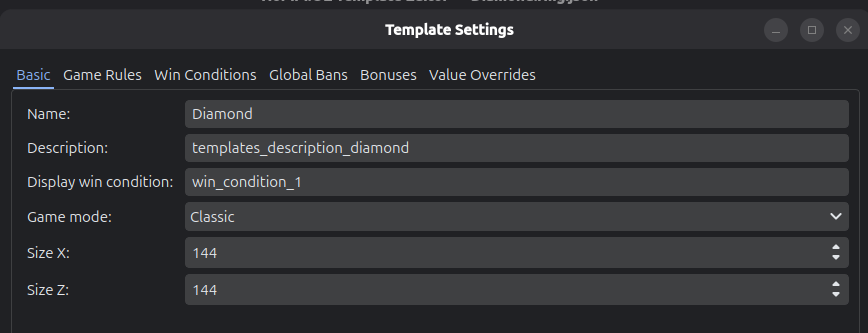 | 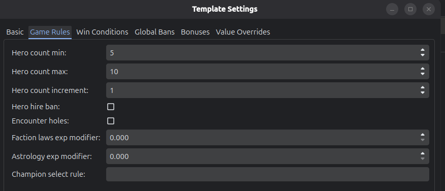 | 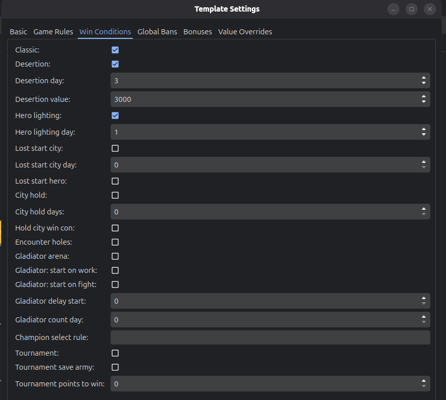 |

| Global bans | Bonuses | Value overrides |
|---|---|---|
| 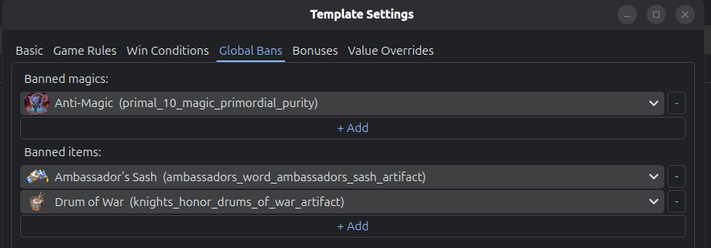 | 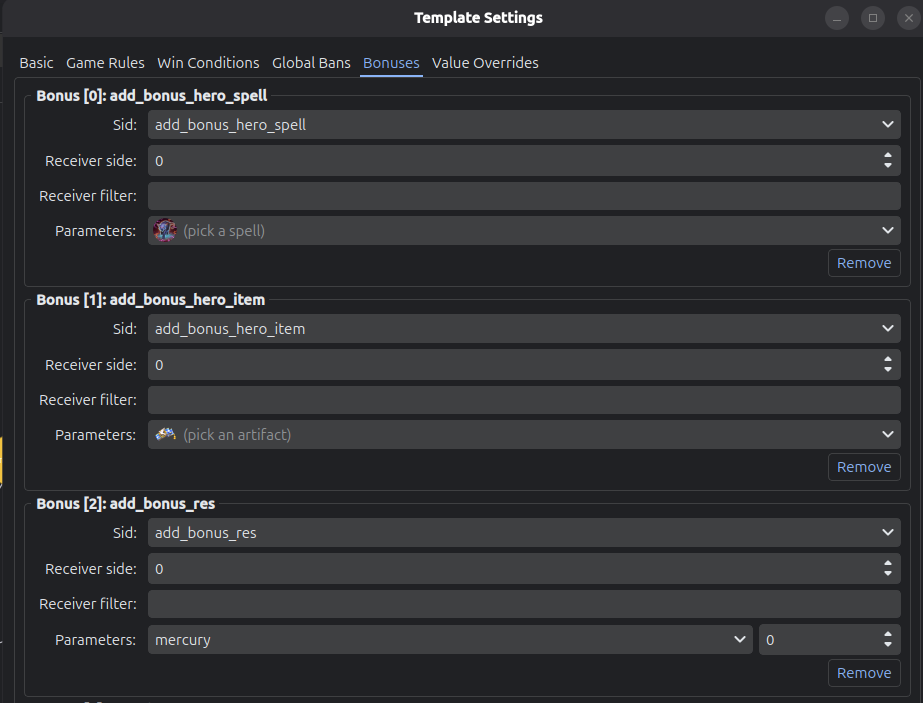 | 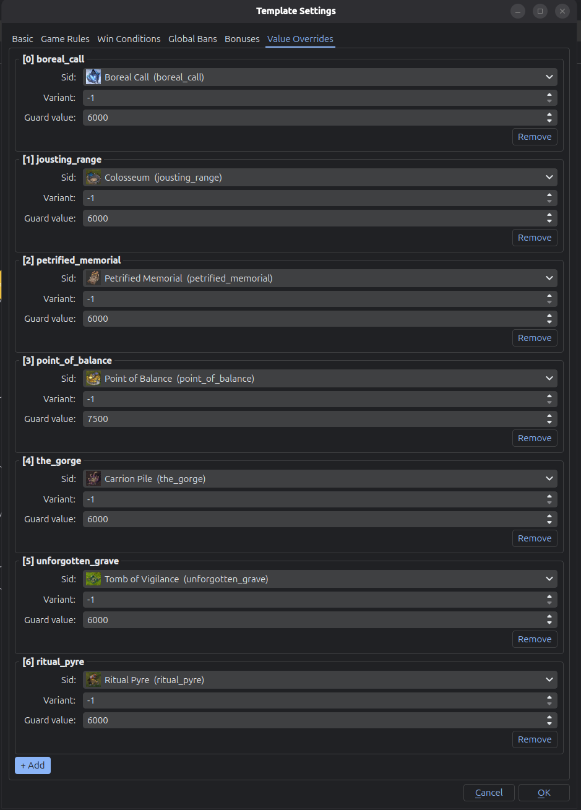 |

### Validation
**Template -> Validate** (or `F5`) checks for the most common authoring errors: zones referencing layouts/bundles/limits that don't exist, connections pointing at zones that don't exist, duplicate names. Double-click any issue to select its target in the editor.

### PNG export
Saving the template (`Ctrl+S`) writes both `<name>.rmg.json` and `<name>.png` to the same directory. The PNG draws the current variant's graph on a parchment background using stylized tile artwork - player tiles for spawns, town overlays for cities, three tiers of treasure tile based on total content value. Hand-tuned zone positions are embedded in the PNG's EXIF data so re-opening the template restores your layout.

---

## File Structure

```
  TemplateEditor/
  ├── pyproject.toml                       # hatchling build, deps, pytest/mypy config
  ├── ruff.toml                            # line-length=120, py312 target, per-file ignores
  ├── README.md
  ├── .gitignore
  ├── data/
  │   └── catalog.json                     # bundled rich catalog snapshot
  ├── scripts/
  │   └── build_catalog.py                 # CLI: produces data/catalog.json from a game install
  ├── src/templategen/
  │   ├── __init__.py
  │   ├── __main__.py                      # python -m templategen
  │   ├── app.py                           # QApplication bootstrap + first-run flow
  │   ├── img/                             # bundled tile artwork for PNG export
  │   ├── model/                           # Pydantic schema (round-trip verified)
  │   │   ├── base.py                      # RmgModel = BaseModel + extra='allow' + populate_by_name
  │   │   ├── enums.py                     # GameMode, ConnectionType, Placement, PlayerId, etc.
  │   │   ├── selectors.py                 # FactionSelector, BiomeSelector ({type, args})
  │   │   ├── content.py                   # ContentItem, MandatoryContentBundle, ContentCountLimit, LimitItem, PlacementRule, Anchor
  │   │   ├── main_objects.py              # SpawnObject/CityObject/AbandonedOutpostObject/GladiatorArenaObject/EmptyMainObject discriminated union
  │   │   ├── connection.py                # DirectConnection/DefaultConnection/PortalConnection/ProximityConnection/GladiatorArenaConnection
  │   │   ├── zone.py                      # Zone + Road + EncounterHolesSettings
  │   │   ├── layouts.py                   # ZoneLayout + ElevationMode + GuardedEncounterResourceFractions + AmbientPickupDistribution
  │   │   ├── game_rules.py                # GameRules, WinConditions, Bonus, GlobalBans, ValueOverride
  │   │   ├── variant.py                   # Variant, Orientation, Border, NoiseLayer
  │   │   └── template.py                  # Template (root)
  │   ├── io/
  │   │   ├── loader.py                    # TemplateLoader.load(path) -> Template
  │   │   ├── writer.py                    # TemplateWriter.write(template, path) - by_alias, exclude_unset
  │   │   ├── json_format.py               # tab-indented dumps/loads
  │   │   └── template_image.py            # PNG render + EXIF position embed/extract
  │   ├── catalog/
  │   │   ├── catalog.py                   # ReferenceCatalog ABC (known_*, get_*, reverse lookups)
  │   │   ├── builder.py                   # build_snapshot(core_root) - schema v8 (artifacts/spells/interactables/resources/fractions)
  │   │   └── game_data.py                 # GameDataCatalog(QObject, ReferenceCatalog) - loads data/catalog.json, precomputes indices
  │   ├── services/
  │   │   ├── session.py                   # EditorSession(QObject) - template, path, undo stack, signals
  │   │   ├── workspace.py                 # Workspace(QObject) + Document - duck-types EditorSession, proxies signals to current document
  │   │   ├── clipboard.py                 # EditorClipboard(QObject) - holds one deep-copied model item, contents_changed signal
  │   │   ├── commands.py                  # QUndoCommand subclasses for every edit kind
  │   │   ├── validator.py                 # Validator - checks dangling refs, duplicate names
  │   │   ├── naming.py                    # auto-naming helpers for new zones / bundles / etc.
  │   │   └── game_assets.py               # game-install discovery + UnityPy texture extraction + QSettings persistence
  │   ├── ui/
  │   │   ├── main_window.py               # MainWindow - multi-document QTabWidget, side docks, menus, file/tools/template actions, icon-polish prewarm
  │   │   ├── theme.py                     # qdarktheme dark + Fusion
  │   │   ├── icons.py                     # IconRegistry - qtawesome (fa5s.*)
  │   │   ├── asset_icons.py               # listable/QIcon helpers for artifacts/spells/interactables/resources/fractions (cached)
  │   │   ├── metadata.py                  # VERSION, CHANGELOG (parsed from changelog.md)
  │   │   ├── canvas/
  │   │   │   ├── graph_scene.py           # GraphScene - rebuilds on template/variant change
  │   │   │   ├── graph_view.py            # GraphView - wheel zoom, AnchorUnderMouse, RubberBandDrag
  │   │   │   ├── zone_item.py             # ZoneItem(QGraphicsObject) - draggable, role-colored
  │   │   │   ├── connection_item.py       # EdgeItem(QGraphicsObject) - stroked-path hit-testing
  │   │   │   ├── alignment.py             # snap/align helpers for dragged zones
  │   │   │   ├── zone_style.py            # color/size derivation from variant
  │   │   │   ├── interactions.py          # add-zone / connect-zones tool state machines
  │   │   │   └── layout.py                # compute_layout(variant) - Kamada-Kawai, proximity excluded
  │   │   ├── panels/
  │   │   │   ├── inspector.py             # Inspector - navigation stack, drill-in/back, per-type populate methods
  │   │   │   ├── library.py               # LibraryPanel - tree of zoneLayouts/mandatoryContent/contentCountLimits
  │   │   │   ├── explorer.py              # CatalogExplorer - 8 tabs with thumbnails + clickable cross-nav
  │   │   │   └── variant_tabs.py          # VariantTabBar - listens to model_object_changed for Template
  │   │   ├── widgets/
  │   │   │   ├── field_binding.py         # bind_string/int/float/bool/choice - return Refresh callables
  │   │   │   ├── listable.py              # ListableItem (value+label+icon) + to_listable helper
  │   │   │   ├── list_editors.py          # ScalarListEditor, ReferenceListEditor, SubObjectListEditor, InlineSubObjectListEditor
  │   │   │   ├── sid_picker.py            # SidPicker - editable QComboBox with case-insensitive substring autocomplete
  │   │   │   ├── selector_combo.py        # type-aware editor for FactionSelector / BiomeSelector
  │   │   │   ├── rule_editor.py           # placement-rule editor widget
  │   │   │   └── sub_object_form.py       # LazySubObjectGroup - collapsible group for optional embedded sub-object
  │   │   └── dialogs/
  │   │       ├── first_run.py             # game-install discovery + asset extraction progress
  │   │       ├── template_settings.py     # 6 tabs: Basic / Game Rules / Win Conditions / Global Bans / Bonuses / Value Overrides
  │   │       └── validation_results.py    # Lists ValidationIssue with severity, double-click -> select target
  │   └── infra/
  │       ├── paths.py                     # AppLocalDataLocation helpers (catalog/icons/extracted Core)
  │       ├── logging.py                   # configure_logging()
  │       └── settings.py                  # AppSettings
  ├── tests/
  │   ├── conftest.py
  │   └── test_io_roundtrip.py             # parametrized over every *.rmg.json
  ├── tmp_scripts/                         # gitignored scratch scripts (analysis & verification)
  └── example-templates/                   # gitignored canonical .rmg.json corpus

```

The dependency direction is strict and one-way: `model -> io -> catalog -> services -> ui`. Lower layers never import from higher ones.

---

## License

MIT.


## How vibed is this?

Unfortunately, very. I would love to artisanally hand-craft every line of code in this codebase, and maybe read a bedtime story to each class before I pull the blanket over them and give them a gentle kiss on the forehead, but I'm working a full-time job as a lead ML engineer and run a small security/ML consultancy agency. Spare time is a luxury I'd rather spend playing HoMM:OE. So if you like something about the project/codebase, it was me and thank you. If you hate something about the project/codebase, I blame Claude and so should you.

## A note on copyrighted assets

The repository does not bundle any game art. Thumbnails shown in the catalog explorer and the inspector dropdowns are extracted at runtime from your own copy of `Core.zip` and stored under your platform's `AppLocalDataLocation`. Without a game install present, the editor falls back to plain-text SIDs.

## "Windows protected your PC"

Yeah, it is an unsigned binary, and windows is paranoid. Make sure you downloaded from the [releases page](https://github.com/ignis-sec/HoMM-OE-Template-Editor/releases/). You can check that it was released by github actions, building the codebase [in this action](https://github.com/ignis-sec/HoMM-OE-Template-Editor/blob/master/.github/workflows/release.yml), so what you download is literally what's in the github repository.

## Why is the executable so large?

Inner machinations of pyinstaller is an enigma, sorry. Python and QT is bundled in the binary there, so that's probably a contributing factor.


## Closing remarks.

Tested on Ubuntu 24.04 (proton gang rise up). So if you are having issues specific to Windows, I'll see what I can do but I'm not enthusiastic about it.

Issues and PR's are appreciated.
