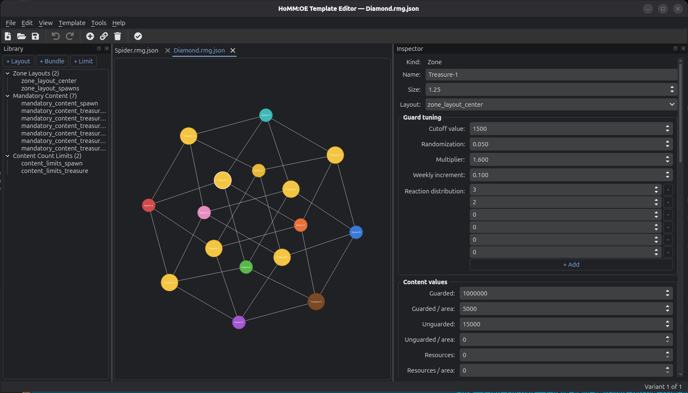
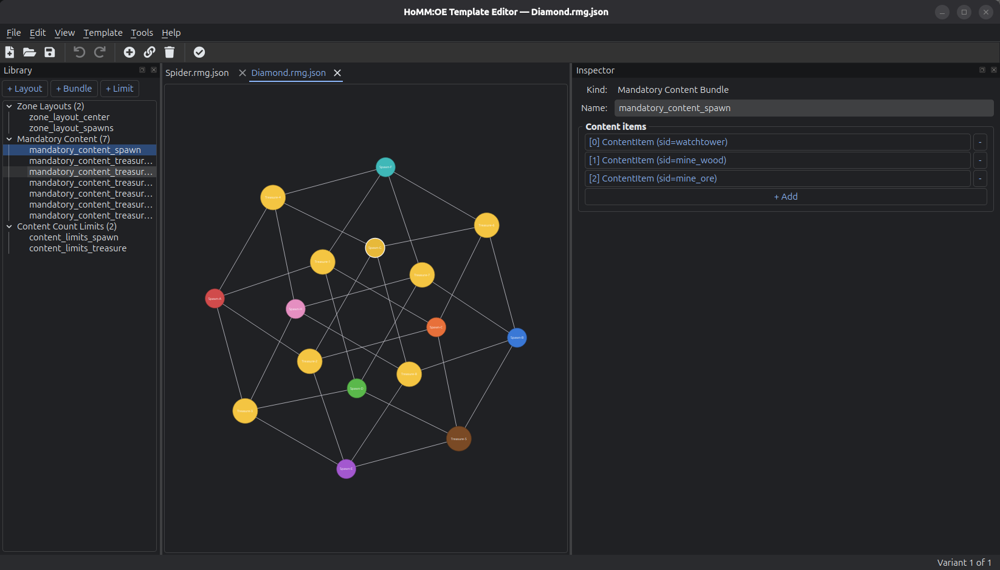
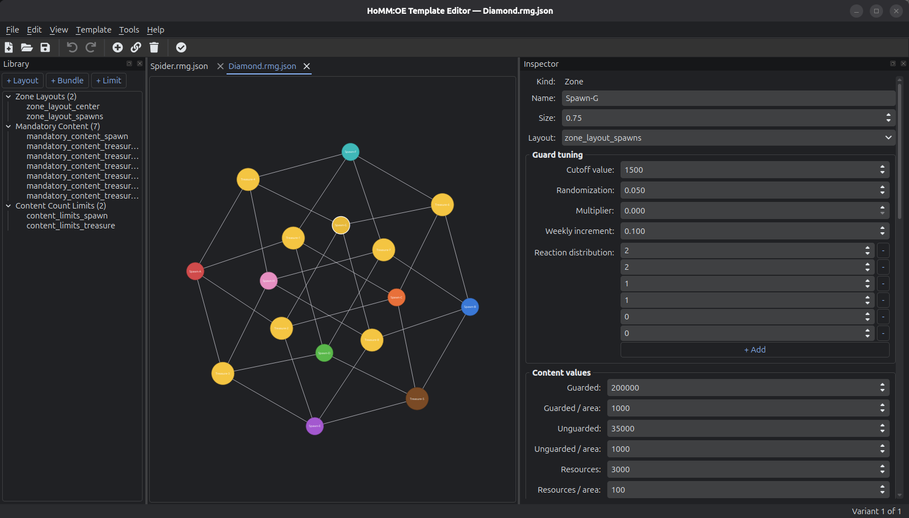
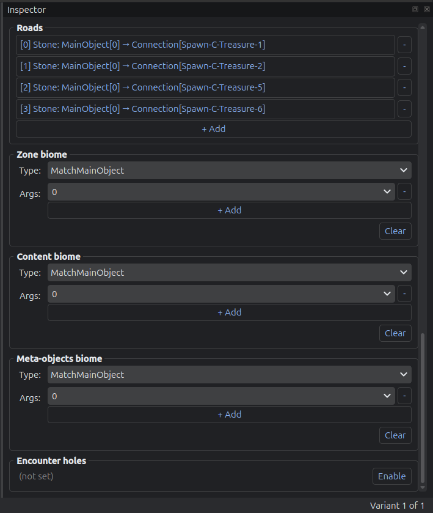
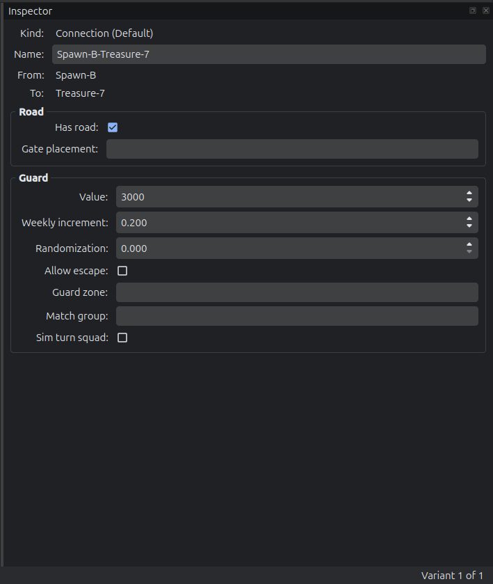
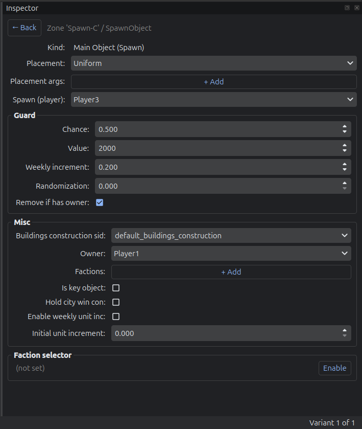

# HoMM OE Template Editor

An editor for **Heroes of Might and Magic: Olden Era** random-map templates (`.rmg.json` files).

Templates define the zones the random map generator places, how they connect, what creatures and treasures appear in them, and which players spawn where. The format is JSON, but hand-editing dozens of cross-referenced zones is tedious and error-prone. This tool gives you a graph canvas, an inspector, a catalog browser, and undo/redo on top of the same JSON files the game reads.

When you save a template, the editor also writes a sibling `.png` next to it - a stylized map of the zones and connections - so you can preview the layout without opening it again.

---

## Example UI








## Install

Requires **Python 3.12+** and a working OpenGL stack (any modern desktop Linux/Mac/Windows works out of the box).

```bash
# clone
git clone https://github.com/ignis-sec/HoMM-OE-Template-Editor.git
cd HoMM-OE-Template-Editor

# create a project-local virtualenv
python3.12 -m venv .venv
source .venv/bin/activate          # Windows: .venv\Scripts\activate

# install the editor
pip install -e .
```

For development tooling (ruff, pytest, mypy):

```bash
pip install -e ".[dev]"
```

That's everything. No system packages, no extra config.

### Install (For plebs)

If you are [this guy](https://www.reddit.com/r/programminghumor/comments/1nq97wc/he_has_a_lot_to_say/), download the latest `HoMM OE Template Editor-vX.Y.Z-windows.exe` from the releases page. It's a single-file build, no installer.

---

## Run

* Running from source, or on Unix:
```bash
templategen            # console script installed by pip
# or
python -m templategen
```

* Windows:

You have an .exe file. You got this champ.


The window opens empty. Use **File -> Open** to load any `.rmg.json` - the project's own examples or templates you've copied out of the game's `Core/Templates/` directory. Use **File -> New** for a blank template.

## Okay but, where do I save the templates?

Linux:

```
~/.steam/steam/steamapps/common/Heroes of Might and Magic Olden Era/HeroesOldenEra_Data/StreamingAssets/map_templates/user
```

Windows:
```
C:\\Program Files (x86)\\Steam\\steamapps\\common\\Heroes of Might & Magic Olden Era\\HeroesOldenEra_Data\\StreamingAssets\\map_templates\\user
```

### Catalog data (optional but recommended in case game was updated)

The catalog explorer and the autocomplete dropdowns are populated from a snapshot of the game's data files. A pre-built snapshot ships in `data/catalog.json`. To regenerate it from a fresh game install:

```bash
python scripts/build_catalog.py /path/to/Core
```

Or from inside the editor: **Tools -> Rebuild Catalog from game-data...**

---

## What the editor does

### Canvas
- Each zone is a draggable circle. Its size scales with the zone's `size` attribute (smallest zone in the variant pins to a base radius; others scale up with `sqrt(size)`).
- Color follows the zone's role:
  - **Spawn zones** get the player color (red, blue, orange, green, purple, teal, yellow, pink for Player 1–8).
  - **Treasure zones** (any zone without a spawn) shade from brown for the lowest total content value to gold for the highest, interpolated across the current variant.
- Connections are lines styled by type (solid, dashed for portals, dotted for proximity, thick red for gladiator arena).

### Editing
- **Add Zone** - toggle the toolbar button, then click on the canvas to place a new zone. New zones default to size 5 and use the first available zone layout.
- **Connect Zones** - toggle the toolbar button, click the source zone, then the target. Creates a Direct connection.
- **Delete** - select zones or connections on the canvas and press `Delete`. Removing a zone also removes any connections that referenced it, in a single undo step.
- All edits go through a `QUndoStack` - `Ctrl+Z` / `Ctrl+Shift+Z` undo and redo.

### Inspector (right dock)
Click any zone, connection, layout, bundle, or count-limit to see all its fields. Lists and embedded objects support drill-in navigation with a back button. Reference fields (SID, content list, content pool, biome, etc.) use editable autocomplete dropdowns backed by the catalog.

### Library (left dock)
Manage the template-level objects that zones reference by name:
- **Zone Layouts** - terrain/obstacle/elevation presets
- **Mandatory Content** - bundles of must-place objects
- **Content Count Limits** - caps on how often certain content can appear

Right-click for copy/cut/paste/duplicate. Paste works across tabs, so you can copy a layout from one open template into another.

### Catalog Explorer (bottom dock, **Tools -> Show Catalog Explorer**)
Four tabs: Content Lists, Content Pools, SIDs, Meta Objects. Each shows what's defined in the game's data, plus reverse lookups (which pools contain a given SID, which lists a pool draws from, etc.). Cross-references are clickable links inside the detail pane.

### Template settings
**Template -> Settings...** opens a six-tab dialog for the template-level fields: basics, game rules, win conditions, global bans, bonuses, and value overrides. Changes apply atomically when you click OK.

### Validation
**Template -> Validate** (or `F5`) checks for the most common authoring errors: zones referencing layouts/bundles/limits that don't exist, connections pointing at zones that don't exist, duplicate names. Double-click any issue to select its target in the editor.

### PNG export
Saving the template (`Ctrl+S`) writes both `<name>.rmg.json` and `<name>.png` to the same directory. The PNG draws the current variant's graph on a parchment background using stylized tile artwork - player tiles for spawns, town overlays for cities, three tiers of treasure tile based on total content value.

---

## File Structure

```
  TemplateEditor/
  ├── pyproject.toml                       # hatchling build, deps, pytest/mypy config
  ├── ruff.toml                            # line-length=120, py312 target, per-file ignores
  ├── README.md
  ├── .gitignore
  ├── data/
  │   └── catalog.json                     # generated rich catalog from core.zip in game files
  ├── scripts/
  │   └── build_catalog.py                 # CLI: produces data/catalog.json from game-data/Core
  ├── src/templategen/
  │   ├── __init__.py                      
  │   ├── __main__.py                      # python -m templategen
  │   ├── app.py                           # QApplication bootstrap
  │   ├── model/                           # Pydantic schema (round-trip verified)
  │   │   ├── base.py                      # RmgModel = BaseModel + extra='allow' + populate_by_name
  │   │   ├── enums.py                     # GameMode, ConnectionType, Placement, PlayerId, etc.
  │   │   ├── selectors.py                 # FactionSelector, BiomeSelector ({type, args})
  │   │   ├── content.py                   # ContentItem, MandatoryContentBundle, ContentCountLimit, LimitItem, PlacementRule, Anchor
  │   │   ├── main_objects.py              # SpawnObject/CityObject/AbandonedOutpostObject/GladiatorArenaObject/EmptyMainObject discriminated union
  │   │   ├── connection.py                # DirectConnection/DefaultConnection/PortalConnection/ProximityConnection/GladiatorArenaConnection (discriminator field is connectionType, not
  type)
  │   │   ├── zone.py                      # Zone + Road + EncounterHolesSettings
  │   │   ├── layouts.py                   # ZoneLayout + ElevationMode + GuardedEncounterResourceFractions + AmbientPickupDistribution
  │   │   ├── game_rules.py                # GameRules, WinConditions, Bonus, GlobalBans, ValueOverride
  │   │   ├── variant.py                   # Variant, Orientation, Border, NoiseLayer
  │   │   └── template.py                  # Template (root)
  │   ├── io/
  │   │   ├── loader.py                    # TemplateLoader.load(path) -> Template
  │   │   ├── writer.py                    # TemplateWriter.write(template, path) - by_alias=True, exclude_unset=True
  │   │   └── json_format.py               # tab-indented dumps/loads
  │   ├── catalog/
  │   │   ├── catalog.py                   # ReferenceCatalog ABC (known_*, get_*, reverse lookups)
  │   │   ├── builder.py                   # build_snapshot(core_path) - schema v2
  │   │   └── game_data.py                 # GameDataCatalog(QObject, ReferenceCatalog) - loads data/catalog.json, precomputes reverse indices, emits changed
  │   ├── services/
  │   │   ├── session.py                   # EditorSession(QObject) - template, path, undo stack, all session signals
  │   │   ├── workspace.py                 # Workspace(QObject) + Document - duck-types EditorSession, proxies signals/methods to current document
  │   │   ├── clipboard.py                 # EditorClipboard(QObject) - holds one deep-copied model item, contents_changed signal
  │   │   ├── commands.py                  # Command (QUndoCommand subclass), EditFieldCommand, AddListItemCommand, RemoveListItemCommand, AddVariantCommand, RemoveVariantCommand
  │   │   └── validator.py                 # Validator - checks dangling refs, duplicate names, returns list[ValidationIssue]
  │   ├── ui/
  │   │   ├── main_window.py               # MainWindow - central QTabWidget of _DocumentTab, side docks, menus, file/tools/template actions
  │   │   ├── theme.py                     # qdarktheme dark + Fusion
  │   │   ├── icons.py                     # IconRegistry - qtawesome (fa5s.*)
  │   │   ├── canvas/
  │   │   │   ├── graph_scene.py           # GraphScene - rebuilds on template/variant change; calls self.rebuild() in __init__
  │   │   │   ├── graph_view.py            # GraphView - wheel zoom, AnchorUnderMouse, RubberBandDrag
  │   │   │   ├── zone_item.py             # ZoneItem(QGraphicsObject) - draggable, role-colored
  │   │   │   ├── connection_item.py       # EdgeItem(QGraphicsObject) - overrides shape() with stroked path for precise hit-testing
  │   │   │   ├── interactions.py          # (stubs; structural editing deferred)
  │   │   │   └── layout.py                # compute_layout(variant) - Kamada-Kawai (proximity edges excluded); spring fallback
  │   │   ├── panels/
  │   │   │   ├── inspector.py             # Inspector - navigation stack, drill-in/back, populate methods for every editable type
  │   │   │   ├── library.py               # LibraryPanel - tree of zoneLayouts/mandatoryContent/contentCountLimits, +Add buttons, context menu Copy/Cut/Duplicate/Paste, _select_model
  after add
  │   │   │   ├── explorer.py              # CatalogExplorer - 4 tabs (Lists/Pools/SIDs/Meta), filter + list + QTextBrowser with clickable cross-nav
  │   │   │   └── variant_tabs.py          # VariantTabBar - listens to model_object_changed for Template
  │   │   ├── widgets/
  │   │   │   ├── field_binding.py         # bind_string/int/float/bool/choice - return Refresh callables
  │   │   │   ├── list_editors.py          # ScalarListEditor, ReferenceListEditor, SubObjectListEditor (drill-in), InlineSubObjectListEditor (expanded rows)
  │   │   │   ├── sid_picker.py            # SidPicker - editable QComboBox with QCompleter (CaseInsensitive, MatchContains)
  │   │   │   └── sub_object_form.py       # LazySubObjectGroup - collapsible group for optional embedded sub-object
  │   │   └── dialogs/
  │   │       ├── template_settings.py     # 6 tabs: Basic / Game Rules / Win Conditions / Global Bans / Bonuses / Value Overrides
  │   │       └── validation_results.py    # Lists ValidationIssue with severity, double-click -> select target
  │   └── infra/
  │       ├── logging.py                   # configure_logging() with basicConfig
  │       └── settings.py                  # AppSettings (stub, not wired)
  ├── tests/
  │   ├── conftest.py
  │   └── test_io_roundtrip.py             # parametrized over every *.rmg.json; 57/57 pass
  ├── tmp_scripts/                         # gitignored scratch scripts (analysis & verification)
  └── example-templates/                   # gitignored canonical .rmg.json corpus

```

The dependency direction is strict and one-way: `model -> io -> catalog -> services -> ui`. Lower layers never import from higher ones.

---

## License

MIT.


## How vibed is this?

Unfortunately, very. I would love to artisanally hand-craft every line of code in this codebase, and maybe read a bedtime story to each class before I pull the blanket over them and give them a gentle kiss on the forehead, but I'm working a full-time job as a lead ML engineer and run a small security/ML consultancy agency. Spare time is a luxury I'd rather spend playing HoMM:OE. So if you like something about the project/codebase, it was me and thank you. If you hate something about the project/codebase, I blame Claude and so should you. 

